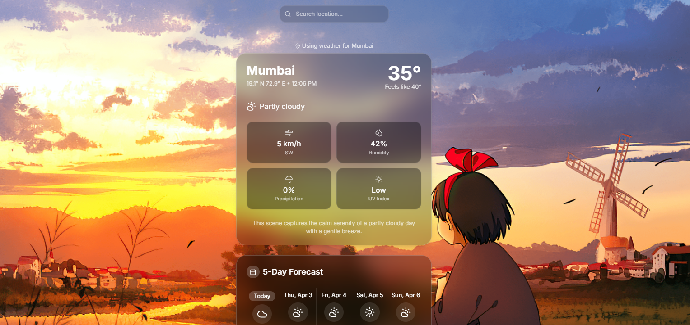

# Climata - Modern Weather App 🌤️

A beautiful, modern weather application built with React, TypeScript, and Vite. Get real-time weather information for any location with a sleek, responsive design.



## Features ✨

- 🌍 Real-time weather data using Open-Meteo API
- 📍 Automatic location detection
- 🔍 Location search with autocomplete
- 📱 Responsive design for all devices
- 🌙 Beautiful UI with glass-morphism effects
- 📊 5-day weather forecast
- 🎨 Modern design with Tailwind CSS
- ⚡ Fast and optimized performance

## Tech Stack 🛠️

- React 18
- TypeScript
- Vite
- Tailwind CSS
- shadcn/ui components
- Open-Meteo API
- OpenStreetMap API

## Getting Started 🚀

### Prerequisites

- Node.js (v16 or higher)
- npm or yarn

### Installation

1. Clone the repository
```bash
git clone https://github.com/iamakchavan/climata.git
cd climata
```

2. Install dependencies
```bash
npm install
```

3. Start the development server
```bash
npm run dev
```

4. Build for production
```bash
npm run build
```

## Deployment 🌐

The project is configured for easy deployment on both Vercel and Netlify.

### Vercel
[](https://vercel.com/new/clone?repository-url=https%3A%2F%2Fgithub.com%2Fiamakchavan%2Fclimata)

### Netlify
[](https://app.netlify.com/start/deploy?repository=https://github.com/iamakchavan/climata)

## API Credits 🙏

- Weather data provided by [Open-Meteo API](https://open-meteo.com/)
- Location data provided by [OpenStreetMap](https://www.openstreetmap.org/)

## Contributing 🤝

Contributions are welcome! Please feel free to submit a Pull Request.

## License 📄

This project is licensed under the MIT License - see the [LICENSE](LICENSE) file for details.

## Author 👤

- GitHub: [@iamakchavan](https://github.com/iamakchavan)

---

Made with ❤️ by AK CHAVAN
